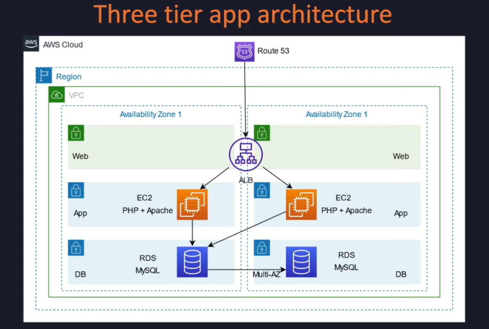
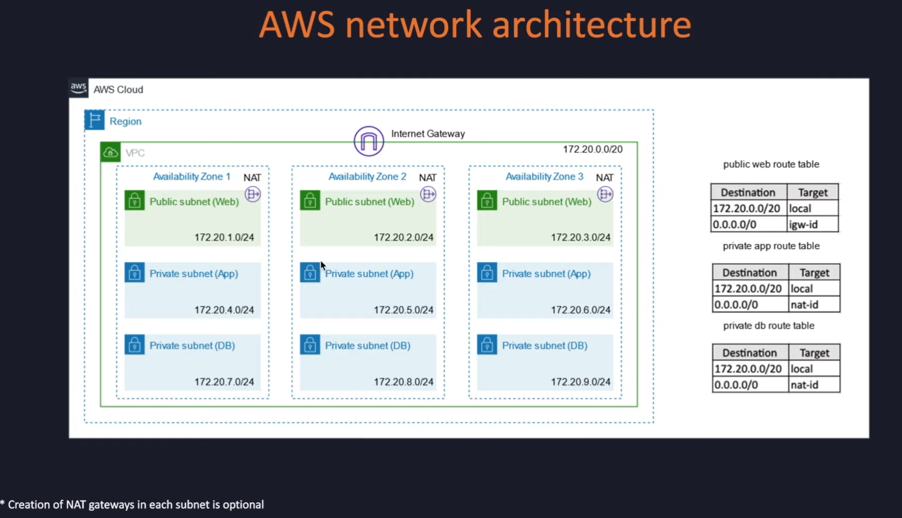

# Three-tier Web Application on AWS

This repository demonstrates the deployment of a three-tier web application architecture on Amazon Web Services (AWS). The architecture includes a **Virtual Private Cloud (VPC)**, **Application Load Balancer (ALB)**, **Elastic Compute Cloud (EC2)** instances, and **Relational Database Service (RDS)**.

## Overview

The three-tier architecture consists of the following components:
- **Presentation Layer:** Application Load Balancer (ALB) to handle incoming web traffic and distribute it across EC2 instances.
- **Application Layer:** EC2 instances in private subnets to host the application.
- **Data Layer:** RDS for secure and scalable data storage.

The architecture ensures scalability, high availability, and security by utilizing multiple AWS services in a structured manner.

---

## Architecture Diagram

---

## Features

- **VPC Configuration:** Custom VPC with public and private subnets across multiple Availability Zones.
- **Load Balancing:** ALB to distribute traffic and ensure fault tolerance.
- **Compute Resources:** Auto-scaled EC2 instances for the application layer.
- **Secure Database Access:** RDS hosted in private subnets with restricted access.
- **Network Security:** Configured security groups and Network Access Control Lists (NACLs).

---

## Prerequisites

- An active AWS account.
- Basic knowledge of AWS services and concepts.
- AWS CLI or Management Console access.

---

## Usage
- Accessing the Web Application: Use the DNS name of the ALB to access the application.
- Monitoring Resources: Utilize AWS CloudWatch for logs and metrics.
- Scaling: Adjust the Auto Scaling group as needed for traffic.

---
## Troubleshooting
- Verify the security group rules for inbound and outbound traffic.
- Ensure correct parameter configurations during template deployment.
- Check logs in CloudWatch for application and system issues.

---
